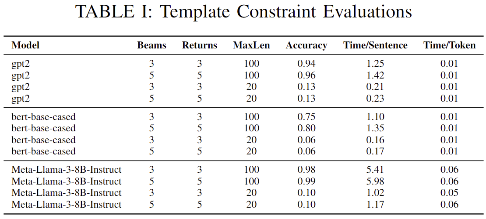
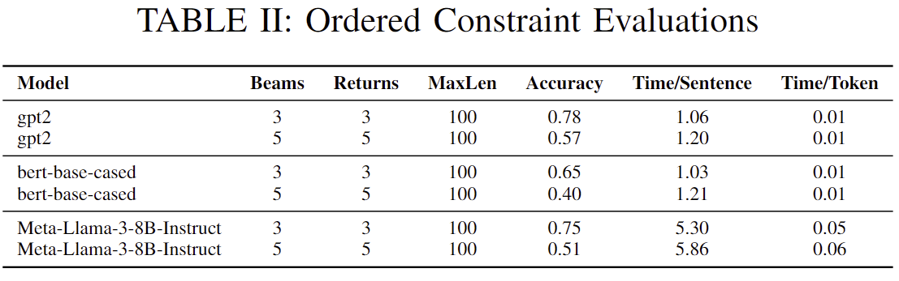
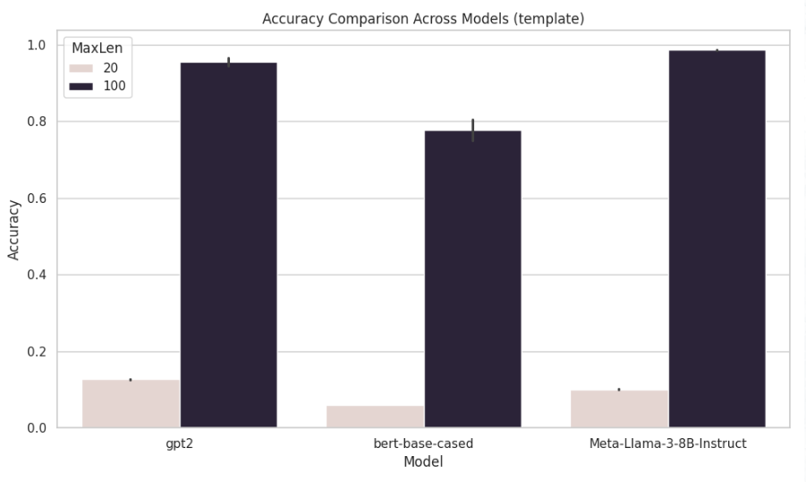
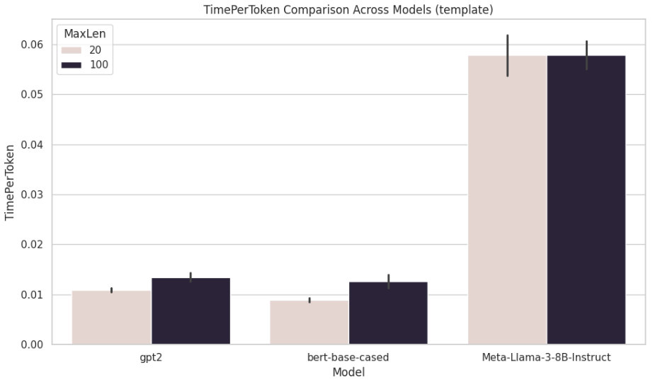
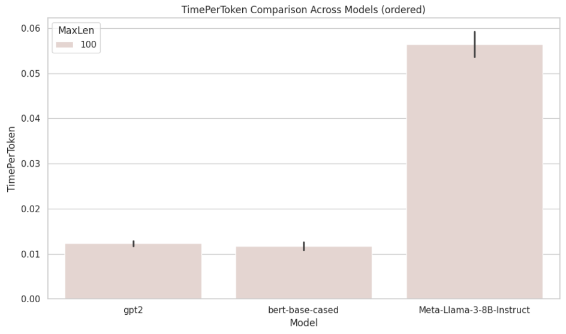
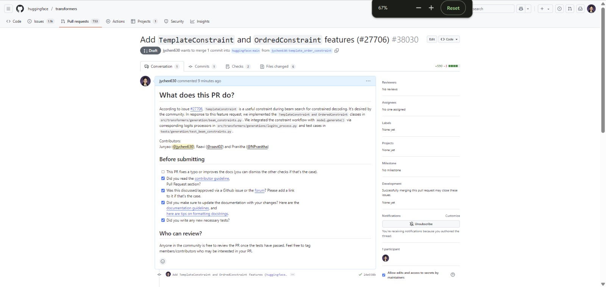
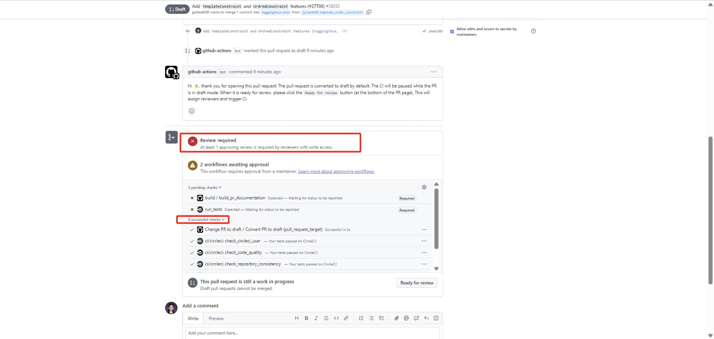

# Enhancing Constraint Beam Decoding in Transformers library

## Team Information
- **Members**:
   - Junyao Chen (jc6385)
   - Raavi Gupta (rg3637)
   - Pranitha Natarajen (pn2435)


## How to navigate this repo
This repo is a wrapper repo to the forked [`huggingface/transformer`](https://github.com/jychen630/transformers) repo that aims to implement `TemplateConstraint` and `OrderedConstraint` features under the umbrella of `transformers/generation` module, beam search constrained decoding.

**File directories**

- **generation/**: The core files we changed to the `transformers` library.

- **test/**: Extensive test scripts or test cases for our features implementation.
This directory contains code to evaluate template-constrained and ordered-constrained generation on various language models using beam search. The evaluation compares generation quality, constraint satisfaction, and inference performance across models like `GPT-2`, `BERT`, and `LLaMA-3`.
   - `inference_TemplateConstraint.py`: Inference script for template-constrained generation.
   - `inference_OrderedConstraint.py`: Inference script for ordered-constrained generation.
   - `run_inference.sh`: Runs inference using templates from `because_mode.jsonl`.
   - `run_inference_ordered.sh`: Runs ordered inference from `because_mode_OrderedTemplate.jsonl`.
   - `get_metrics.py`: Script to compute and report metrics including:
   - Template satisfaction accuracy
   - Average generation time per sentence
   - Average time per token

- **demo/**: Our demo web app code and screenshots shown in presentation.

- **assets/**: Miscellenais files like images or other notekeeping files.

## Relation to the `huggingface/transformers` library

According to huggingface transformer repo issue [#27706](https://github.com/huggingface/transformers/issues/27706), `TemplateConstraint` is a useful constraint during beam search for constrained decoding. It's desired by the community. In response to this feature request, we implemented the `TemplateConstraint and OrderedConstraint` classes in `src/transformers/generation/beam_constraints.py`. We integrated the constraint workflow with `model.generate()` via corresponding logits processors in `src/transformers/generations/logits_process.py` and test cases in `tests/generation/test_beam_constraints.py`.

## Reproducibility Instructions

To set up a conda environment and install this forked version of the `transformers` library, follow these steps:

1. **Create and activate a new conda environment**:

   ```bash
   conda create --name hpml python=3.10.16
   conda activate hpml
   ```

2. **Install the forked repository**:
   ```bash
   pip install git+https://github.com/jychen630/transformers@template_order_constraint
   ```

Our algorimth implementations are entierly reflected on `github.com/jychen630/transformers@template_order_constraint`. That's why you should install our branch on forked version of `transformers`, rather than the official transformer library.
Namely, please dont do `pip install transformers` but do the installation through the https link above.

3. **Install other dependencies**:

   ```bash
   pip install wandb torch
   pip install 'accelerate>=0.26.0'
   ```

4. To run the test,
```bash
# please make sure to change the sys.insert() in the python files inference_TemplateConstraint and inference_OrderedConstraint to point to local transformers library.
cd test
chmod +x run_inference.sh          # for TemplateConstraint class
chmod +x run_inference_ordered.sh  # for OrderedConstraints class
./run_inference.sh
./run_inference_ordered.sh

```
This runs `inference_TemplateConstraint.py` across combinations of:

Models: `gpt2`, `google-bert/bert-base-cased`, `meta-llama/Meta-Llama-3-8B-Instruct`

Beam sizes: 3, 5

Maximum output lengths: 20, 100

5. After generating output files, run:
```bash
python get_metrics.py
```
This will parse the .jsonl output files and print aggregated metrics including accuracy and inference time statistics.

6. To run the demo, run
```bash
pip install flask
cd demo
python3 demo.py
```

In your local browser, visit `http://127.0.0.1:5000/`. It will render `templates/demo.html`.

## Results










### WandB report
- [🧾 Template-Constrained Generation W&B Report](https://wandb.ai/rg3637-columbia-university/template-constrained-gen-inference/reports/Template-Constraints--VmlldzoxMjY3OTE4NA?accessToken=methzkvxuzk9rp8zw857xepc9ppqe5syoekq5vacu9lj8q7ejnoe3i94j0shfbwd)
- [🧾 Ordered-Constrained Generation W&B Report](https://wandb.ai/rg3637-columbia-university/ordered-constrained-gen-inference/reports/Ordered-Constraints--VmlldzoxMjY3OTE2Nw?accessToken=pwzkqsdabpjl6700vlx3s5jvgaudh7tjp3ib7ptz9bj28il8prtmcpezbxplzujz)


**Observation**
For 100 new tokens, LLaMA-8B achieves up to 98% template accuracy, with further gains expected as token count increases. Despite its smaller size (124M parameters), GPT-2 performs comparably. 

While Slower, Larger Models Increase the Likelihood of Template Satisfaction


### Ordered Constraint




**Observation**
A similar trend in accuracy and time is observed for ordered constraints; however, satisfaction rates decline due to the increased token span required to fulfill the constraint, as any number of intervening tokens are permitted between target words.

While Slower, Larger Models Increase the Likelihood of Template Satisfaction


## The Issue and Pull Request to `huggingface/transformers`

`TemplateConstraint` and `OrderedConstraint` are features desired by the community (espeicially the first one): Issue [#27706](https://github.com/huggingface/transformers/issues/27706) on `huggingface/transformers` shows community discussions about the feature request. Our team forked the repo, branched from their `main` and push our changes. We make a pull request to the them. [The PR #38030](https://github.com/huggingface/transformers/pull/38030) has passed the necessary CI checks and is pending maintainers' review. 




Constrained beam search is the topical umbrella above `TemplateConstraint` and `OrderedConstraint`. Here is a friendly [introduction](https://huggingface.co/blog/constrained-beam-search).


> Update: As of May 12, 2025, the [pull request](https://github.com/huggingface/transformers/pull/38030) has been under review by a Huggingface community maintainer.

## Team Contribution breakdown

The commits sorted by datetime in decreasing order are listed below.
(Code that generate this: `assets/contribution.sh`)

| Branch/Commit | Author       | Date_EST           | Title                                                                 |
|---------------|--------------|--------------------|-----------------------------------------------------------------------|
| [template_order_constraint/24e938b2b5](https://github.com/jychen630/transformers/commit/24e938b2b5) | Junyao Chen  | 2025-05-08 18:30:22 | "Add `TemplateConstraint` and `OrdredConstraint` features (#27706)"  |
| [junyao_fast_single_template_constraint/663053c0cb](https://github.com/jychen630/transformers/commit/663053c0cb) | Raavi Gupta  | 2025-05-06 23:05:08 | "ordered constraints unit tests added"                                |
| [junyao_fast_single_template_constraint/ae9a746a61](https://github.com/jychen630/transformers/commit/ae9a746a61) | N Pranitha   | 2025-05-06 21:41:15 | "minor"                                                               |
| [pranithan/ordered_constraints/5c66aa76d3](https://github.com/jychen630/transformers/commit/5c66aa76d3) | N Pranitha   | 2025-05-06 21:16:36 | "added boost and penalize to the ordered constraint logits processor" |
| [junyao_fast_single_template_constraint/0e8abf97e7](https://github.com/jychen630/transformers/commit/0e8abf97e7) | N Pranitha   | 2025-05-06 21:16:36 | "added boost and penalize to the ordered constraint logits processor" |
| [pranithan/ordered_constraints/f4bfdb3639](https://github.com/jychen630/transformers/commit/f4bfdb3639) | Junyao Chen  | 2025-05-05 22:10:51 | "Alternative version of OrderedConstraint"                            |
| [junyao_fast_single_template_constraint/f4de0f57d9](https://github.com/jychen630/transformers/commit/f4de0f57d9) | Junyao Chen  | 2025-05-05 22:10:51 | "Alternative version of OrderedConstraint"                            |
| [junyao_fast_single_template_constraint/7cf91448c8](https://github.com/jychen630/transformers/commit/7cf91448c8) | N Pranitha   | 2025-05-05 16:28:10 | "add ordered constraints"                                             |
| [pranithan/ordered_constraints/9f861e412a](https://github.com/jychen630/transformers/commit/9f861e412a) | N Pranitha   | 2025-05-05 16:28:10 | "add ordered constraints"                                             |
| [junyao_fast_single_template_constraint/d69ef8372b](https://github.com/jychen630/transformers/commit/d69ef8372b) | Raavi Gupta  | 2025-05-05 02:02:49 | "commit the tests"                                                    |
| [junyao_fast_single_template_constraint/2249a205c8](https://github.com/jychen630/transformers/commit/2249a205c8) | Raavi Gupta  | 2025-05-05 01:57:27 | "resetting the initialization as initialization is is being overided by constraints class" |
| [junyao_fast_single_template_constraint/ae2af0fd20](https://github.com/jychen630/transformers/commit/ae2af0fd20) | Raavi Gupta  | 2025-05-05 01:51:31 | "removing vocab length parameter in the template as it is very model specific. making the code model agnostic" |
| [pranithan/ordered_constraints/cfcf05aa02](https://github.com/jychen630/transformers/commit/cfcf05aa02) | Junyao Chen  | 2025-05-01 15:17:11 | "Sync my test code"                                                   |
| [junyao_fast_single_template_constraint/cfcf05aa02](https://github.com/jychen630/transformers/commit/cfcf05aa02) | Junyao Chen  | 2025-05-01 15:17:11 | "Sync my test code"                                                   |
| [pranithan/ordered_constraints/a89f92929b](https://github.com/jychen630/transformers/commit/a89f92929b) | Junyao Chen  | 2025-05-01 15:16:50 | "Enforce template constraint logit processor to mask all other tokens except for the template tokens" |
| [junyao_fast_single_template_constraint/a89f92929b](https://github.com/jychen630/transformers/commit/a89f92929b) | Junyao Chen  | 2025-05-01 15:16:50 | "Enforce template constraint logit processor to mask all other tokens except for the template tokens" |
| [pranithan/ordered_constraints/b159315005](https://github.com/jychen630/transformers/commit/b159315005) | Junyao Chen  | 2025-05-01 15:16:11 | "Add support to a list of constriants, rather than a single constraint, on the dashboard" |
| [junyao_fast_single_template_constraint/b159315005](https://github.com/jychen630/transformers/commit/b159315005) | Junyao Chen  | 2025-05-01 15:16:11 | "Add support to a list of constriants, rather than a single constraint, on the dashboard" |
| [pranithan/ordered_constraints/827e6595ef](https://github.com/jychen630/transformers/commit/827e6595ef) | Junyao Chen  | 2025-04-28 16:52:18 | "Add simple workable test for TemplateConstraint with single constraint at a time" |
| [junyao_fast_single_template_constraint/827e6595ef](https://github.com/jychen630/transformers/commit/827e6595ef) | Junyao Chen  | 2025-04-28 16:52:18 | "Add simple workable test for TemplateConstraint with single constraint at a time" |
| [pranithan/ordered_constraints/670fa0b73b](https://github.com/jychen630/transformers/commit/670fa0b73b) | Junyao Chen  | 2025-04-28 16:45:34 | "Implement TemplateConstraint (linear method for single constriant in the constraint list)" |
| [junyao_fast_single_template_constraint/670fa0b73b](https://github.com/jychen630/transformers/commit/670fa0b73b) | Junyao Chen  | 2025-04-28 16:45:34 | "Implement TemplateConstraint (linear method for single constriant in the constraint list)" |
| [pranithan/ordered_constraints/e5fc7f2cd8](https://github.com/jychen630/transformers/commit/e5fc7f2cd8) | Junyao Chen  | 2025-04-28 16:40:05 | "Fix unexpected None or empty array that torch longtensor does not allow" |
| [junyao_fast_single_template_constraint/e5fc7f2cd8](https://github.com/jychen630/transformers/commit/e5fc7f2cd8) | Junyao Chen  | 2025-04-28 16:40:05 | "Fix unexpected None or empty array that torch longtensor does not allow" |
| [junyao/56f912c183](https://github.com/jychen630/transformers/commit/56f912c183) | Junyao Chen  | 2025-04-16 20:54:59 | "Second version"                                                      |
| [raavi/5905c6cef4](https://github.com/jychen630/transformers/commit/5905c6cef4) | Junyao Chen  | 2025-04-17 17:47:29 | "Try to understand the internal code logic"                           |
| [junyao_fast_single_template_constraint/29549db09c](https://github.com/jychen630/transformers/commit/29549db09c) | Raavi Gupta  | 2025-04-14 16:33:48 | "working slow template constraint"                                    |
| [pranithan/ordered_constraints/29549db09c](https://github.com/jychen630/transformers/commit/29549db09c) | Raavi Gupta  | 2025-04-14 16:33:48 | "working slow template constraint"                                    |
| [raavi/29549db09c](https://github.com/jychen630/transformers/commit/29549db09c) | Raavi Gupta  | 2025-04-14 16:33:48 | "working slow template constraint"                                    |


